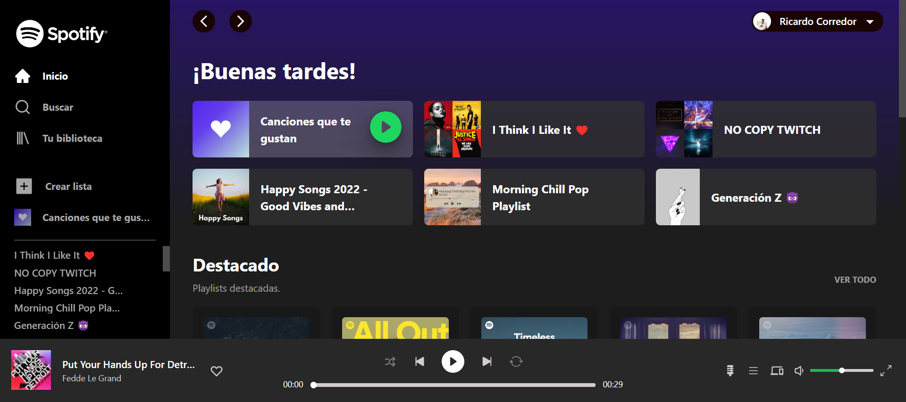
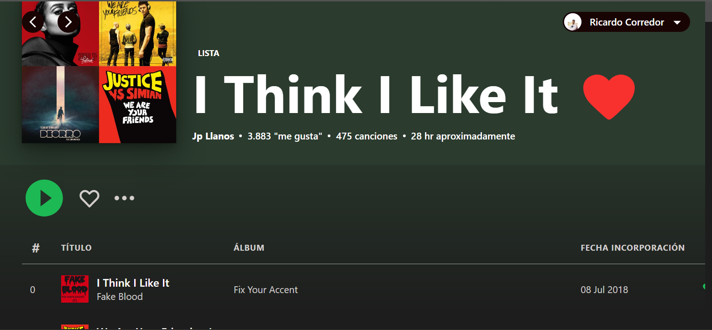
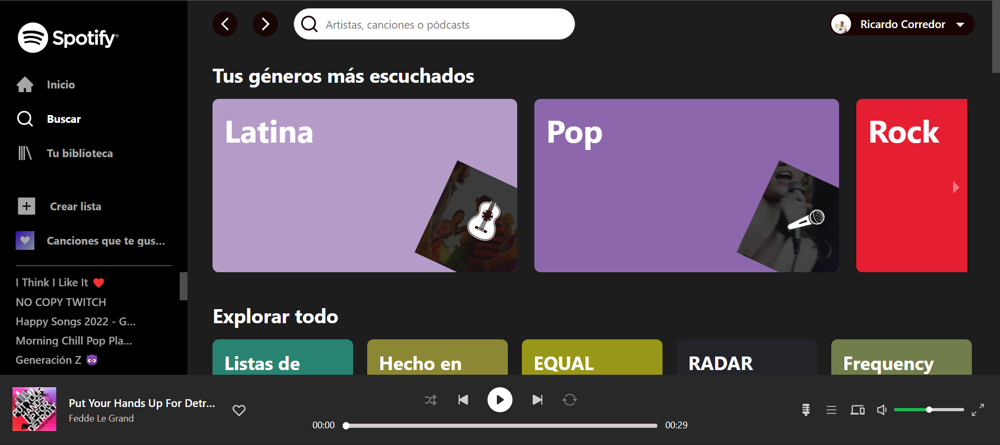
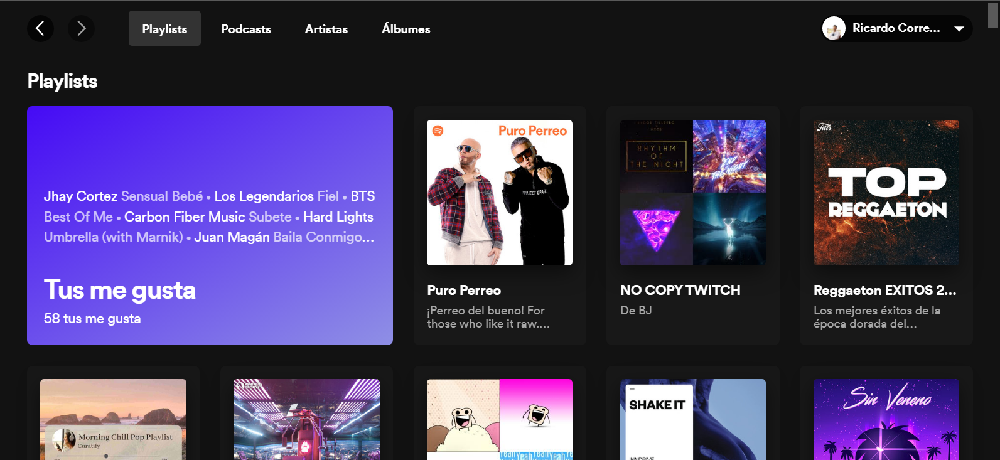

[](https://github.com/xioperez01/spotify-clone/issues)
[](https://github.com/xioperez01/spotify-clone/network)
[](https://github.com/xioperez01/spotify-clone/stargazers)

# Spotify Clone 
## Table of contents
* [General info](#general-info)
* [Demo](#demo)
* [App](#app)
* [Technologies](#technologies)
* [Setup](#setup)

## General info
This repository contains our clone of the Spotify web application.

We wanted to carry out this project in order to apply and expand our knowledge and skills in web development.

Our main goal has been to visually clone the Spotify web app and connect to its API to fetch data and recreate some functionality.

By connecting our application to the Spotify API, we can recreate functionalities such as sign in with our spotify user, viewing our playlists, searching for new lists, artists, tracks, podcasts, etc., creating new lists; all with our data from the original Spotify app.

## Demo
Here is a working live demo :

## App

Some layouts:

  |  
:-------------------------:|:-------------------------:
  |
	
## Technologies
This project is created with:
* React JS
* Chakra UI
* Spotify API
* CSS

## Setup
To run this project, after cloning our repository, install it locally using npm:

```
$ cd spotify-clone
$ npm install
$ npm start
```
## Authors
* **Angie Perez** - [xioperez01](https://github.com/xioperez01)
* **Martin Corredor** - [martincorredor](https://github.com/martincorredor)

## [License](https://github.com/xioperez01/spotify-clone/blob/main/LICENSE)
MIT © [Angie Perez](https://github.com/xioperez01),  [Martin Corredor](https://github.com/martincorredor)